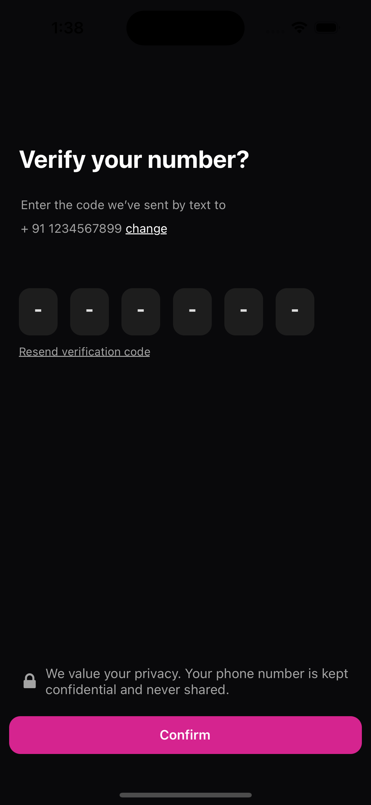

<h1 align="center"> React Native OTP </h1>

<div align="center">
  
</div>

<p align="center">
  <strong>Light Weight and Robust Splitted Text Input for React Native</strong>
</p>

<p align="center">
  <a href="https://github.com/your-username/react-native-text-input-otp#compatibility">Compatibility</a>
  •
  <a href="https://github.com/your-username/react-native-text-input-otp#installation">Installation</a>
  •
  <a href="https://github.com/your-username/react-native-text-input-otp#usage">Usage</a>
  •
  <a href="https://github.com/your-username/react-native-text-input-otp#props">Props</a>
</p>

## Features

- Design split OTP component of your choice
- Pass number of OTP digits by your choice
- Fully customizable with props
- Very easy to use
- Make your apps professional in UI/UX

## Compatibility

| Platform | iOS | Android | Expo |
| -------- | --- | ------- | ---- |
| ✅       | ✅  | ✅      | ✅   |

## Installation

```sh
npm install react-native-text-input-otp
```

or

```sh
yarn add react-native-text-input-otp
```

## Usage

All you need is to just import the OTP text input component and then pass the required props to display the splitted OTP text input as shown in the code snippet below:

```jsx
import OtpTextInput from "react-native-text-input-otp";

const App = () => {
  const [otp, setOtp] = React.useState("");

  return <OtpTextInput otp={otp} setOtp={setOtp} digits={5} />;
};
```

## Props

| Name                 | Type                | Required | Description                     |
| -------------------- | ------------------- | -------- | ------------------------------- |
| `otp`                | state variable      | Yes      | State variable to store the OTP |
| `setOtp`             | state update method | Yes      | Method to update state variable |
| `digits`             | number              | Yes      | Number of OTP split fields      |
| `style`              | style object        | No       | Style of the input fields       |
| `fontStyle`          | style object        | No       | Style of font in input fields   |
| `focusedStyle`       | style object        | No       | Style of field when in focus    |
| `keyboardAppearance` | string              | No       | Keyboard Appearance Style       |

## Contributing

Contributions are welcome! Please follow the [contributing guidelines](CONTRIBUTING.md) when submitting a pull request.

## License

This project is licensed under the [MIT License](LICENSE).
